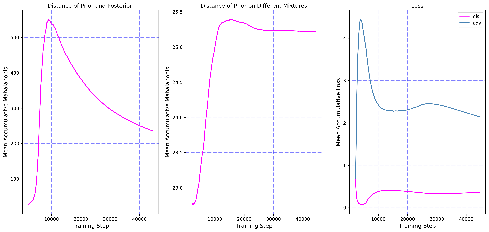
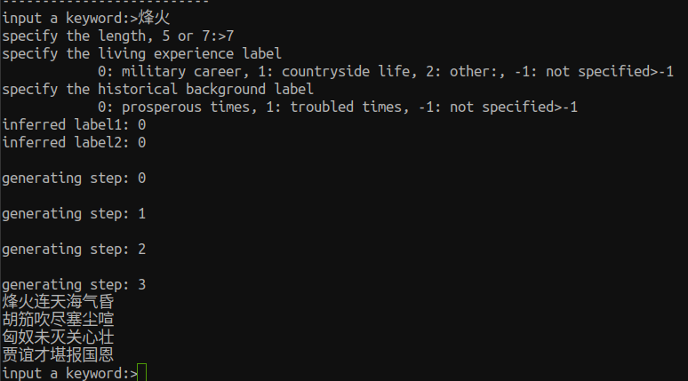
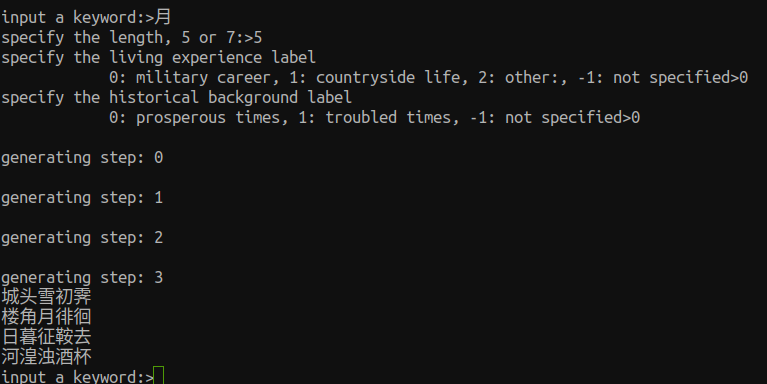
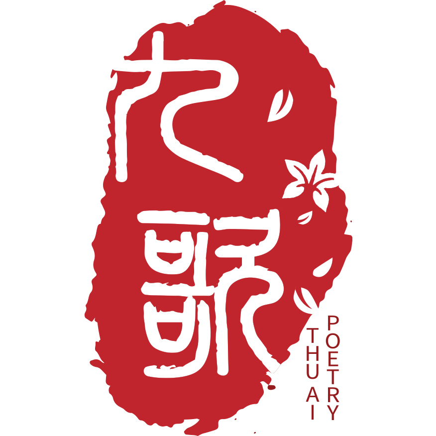

# MixPoet
The source code of [*MixPoet: Diverse Poetry Generation via Learning Controllable Mixed Latent Space*](https://arxiv.org/pdf/2003.06094.pdf) (AAAI 2020).

## 1. Rights
All rights reserved.

## 2. Requirements
* python>=3.7.0
* pytorch>=1.3.1
* sklearn>=0.19.2
* matplotlib>=2.2.3 

## 3. Data Preparation
To train the model and generate poems, please 

* add the training, validation and testing sets of our [THU-CCPC](https://github.com/THUNLP-AIPoet/Datasets/tree/master/CCPC) data into the *MixPoet/preprocess/*  directory;
* add the pingsheng.txt, zesheng.txt, pingshui.txt and pingshui_amb.pkl files of our [THU-CRRD](https://github.com/THUNLP-AIPoet/Datasets/tree/master/CRRD) set into the *MixPoet/data/*  directory.

We provide a small sampled subset of the labelled CQCF in the *preprocess*  directory to test these codes. We will consider releasing the full CQCF set in the future.  You can also use your own data.

## 4. Preprocessing
In Mixpoet/preprocess/, just run:
```
python preprocess.py --n 150000
```
The parameter *n* indicates the number of unlabelled instances to be used for semi-supervised training. When one uses the provided sampled CQCF set, we recommend *n* is about 150,000. With a larger labelled dataset, one can set a larger *n*.

After running preprocess.py, please move the generated vocab.pickle, ivocab.pickle, semi_train.pickle and semi_valid.pickle into *MixPoet/corpus/*,  and move test_inps.txt and training_lines.txt into *MixPoet/data/*.

## 5. Training
In MixPoet/codes/, run:
```
python train.py
```
The encoder and decoder will be pre-trained as a denoising autoencoder, and the classifiers will be pre-trained with the labelled poems. Then the MixPoet model is trained based on these pre-trained modules.

One can also edit MixPoet/codes/**config.py**  to modify the configuration, such as the hidden size, embedding size, data path, training epoch, learning rate and so on.

During the training process, some training information is outputed, such as:

<div align=center></div>

The training and validation information is saved in MixPoet/log/.  We also draw the average accumulative adversarial loss, discriminator loss and the distance of points sampled from the prior and the posterior cdistributions respectively, as well as the distance of points sampled from the prior distributions conditioned on different mixtures.

<div align=center></div>

## 6. Generation
To generate a poem in an interactive interface, in MixPoet/codes/, run:
```
python generate.py -v 1
```
Then one can input the keyword, length and factor labels, and then get the generated pome:

<div align=center>


</div>


By running:
```
python generate.py -v 1 -s 1
```
one can manually select each generated line from the beam candidates.

To generate poems with an input testing file, which contains a set of keywords, run:
```
python generate.py -m file -l 5 -i ../data/test_inps.txt -o outs_5char.txt
```
where l = 5 or 7, indicating the 5-char-line or 7-char-line quatrains.

## 7. Cite
If you use our source code, please kindly cite this paper:

Xiaoyuan Yi, Ruoyu Li, Cheng Yang, Wenhao Li and Maosong Sun. 2020.  MixPoet: Diverse Poetry Generation via Learning Controllable Mixed Latent Space. In *Proceedings of The Thirty-Fourth AAAI Conference on Artificial Intelligence*, New York, USA.

The bib format is as follows:
```
@inproceedings{Mixpoet:20,
    author  = {Xiaoyuan Yi and Ruoyu Li and Cheng Yang and Wenhao Li and Maosong Sun},
    title   = {MixPoet: Diverse Poetry Generation via Learning Controllable Mixed Latent Space},
    year    = "2020",
    booktitle = {Proceedings of The Thirty-Fourth AAAI Conference on Artificial Intelligence},
    address = {New York, USA}
}
```

## 8. System
This work is a part of the automatic Chinese poetry generation system, [THUAIPoet (Jiuge, 九歌)](https://jiuge.thunlp.cn) developed by Research Center for Natural Language Processing, Computational Humanities and Social Sciences, Tsinghua University (清华大学人工智能研究院, 自然语言处理与社会人文计算研究中心). Please refer to [THUNLP](https://github.com/thunlp) and [THUNLP Lab](http://nlp.csai.tsinghua.edu.cn/site2/) for more information.

<div align=center></div>

## 9. Contact
If you have any questions, suggestions or bug reports, please feel free to email yi-xy16@mails.tsinghua.edu.cn or mtmoonyi@gmail.com.
